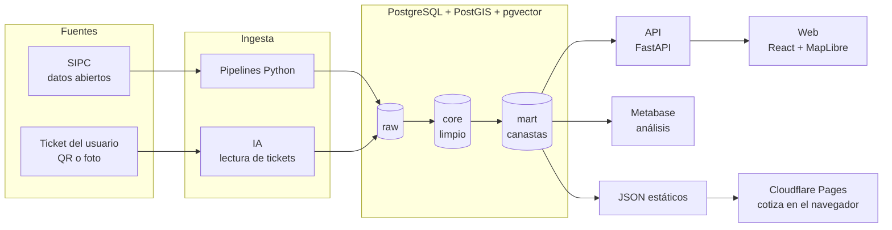

# 🛒 Canasta UY

**Compras al menor costo en Uruguay.** Una web donde ponés tu presupuesto, elegís tu
ciudad en un mapa y armás tu canasta con productos genéricos ("aceite de girasol",
"arroz"). Te muestra en qué comercios te conviene comprarla. Después podés guardar tu
ticket en **Mis compras** y ver cómo te fue comparado con tu compra anterior.

Construida sobre los **datos abiertos oficiales del SIPC** (Sistema de Información de
Precios al Consumidor): 40 millones de precios de 2025 y 2026 en casi 900 comercios de todo el país.

**👉 Probala: [canastauy.pages.dev](https://canastauy.pages.dev/)**

> 🚧 Proyecto en construcción. Ver [hoja de ruta](#hoja-de-ruta).


<p align="center">
  
  
  
</p>

## Qué podés hacer

- **Armar tu canasta** con productos genéricos y ver, en el mapa, en qué comercios cercanos
  te sale más barata, con lo que falta en cada uno. Guardarla en **Mis listas** para la
  próxima vez.
- **Guardar tus compras** a partir del ticket: el QR de la DGI dice dónde, cuándo y cuánto;
  la foto de la boleta, qué compraste (se lee en el teléfono, borrando antes los datos de
  pago y personales, y se revisa antes de guardar). **Mis compras** compara cada compra con
  la anterior y muestra qué productos subieron.
- **Cuenta opcional** (inicio con Google) para tener el historial en cualquier dispositivo.
  Sin cuenta, todo queda en tu teléfono. Ver la [política de privacidad](https://canastauy.pages.dev/privacidad).

## Qué resuelve

Para saber dónde conviene comprar, hay que comparar la **canasta completa**, no un
producto suelto. Para eso hace falta:

- **comparar productos genéricos** entre marcas y tamaños: se lleva todo a precio por
  kilo, litro o unidad (*"Envase 900 cc"* → 0,9 l);
- **ubicar los comercios** cerca del usuario (PostGIS);
- **avisar la cobertura:** si un comercio no tiene todos los productos de la canasta,
  decirlo en lugar de comparar mal;
- **mostrar la antigüedad de los precios**: el SIPC se publica cada trimestre.

## Arquitectura



### Dos formas de correr la web

- **Con servidor (desarrollo):** la web le pregunta a la API, que le pregunta a Postgres.
- **Estática (la versión publicada):** un script exporta los precios vigentes a dos archivos
  JSON (~1,3 MB, ~280 KB comprimidos) y la canasta se cotiza en el navegador con
  [`web/src/lib/cotizar.ts`](web/src/lib/cotizar.ts), una copia en TypeScript de la función
  SQL `mart.cotizar_canasta`. Un test compara las dos con cientos de canastas al azar y
  tienen que dar exactamente lo mismo (comercios, totales, detalle y distancias).
  Un workflow de GitHub Actions ([`publicar.yml`](.github/workflows/publicar.yml)) baja el
  SIPC cada mes, lo carga en un Postgres temporal, regenera los archivos y vuelve a publicar.
  Sin servidor y sin costo.

### Capas de datos

- **`raw`:** cada archivo tal cual vino de la fuente, con sus errores. Permite volver
  siempre al original.
- **`core`:** datos limpios y validados. Por ejemplo, se corrigen las coordenadas de los
  comercios (el SIPC trae latitud y longitud cruzadas), se eliminan los precios duplicados
  del mismo día y se separan cantidad y unidad (*"Paquete1 kg."* → 1 kg).
- **`mart`:** tablas y vistas listas para la web y los dashboards.

Esquema: [`sql/init/01_esquema.sql`](sql/init/01_esquema.sql) · Transformación del
SIPC: [`sql/transform/sipc_core.sql`](sql/transform/sipc_core.sql).

## Fuentes de datos

| Fuente | Uso | Acceso |
|---|---|---|
| [SIPC – Defensa del Consumidor (MEF)](https://www.precios.uy/) | Precios, comercios y productos | [Datos abiertos](https://catalogodatos.gub.uy/dataset/defensa-del-consumidor-sistema-de-informacion-de-precios-al-consumidor-2025) |
| Tickets de los usuarios | Precios actuales y compras de cada usuario | QR del CFE (DGI) o foto |

Detalle de todas las fuentes, incluidas las evaluadas y descartadas:
[`docs/FUENTES.md`](docs/FUENTES.md). No se hace *scraping* de sitios ni de aplicaciones.

## Cómo levantarlo

Requisito: Docker Desktop. Python también corre en Docker, así que no hace falta
instalarlo ni armar un entorno virtual.

```bash
cp .env.example .env              # y cambiá POSTGRES_PASSWORD
docker compose up -d              # Postgres, Metabase, la API y la web

# Pipeline del SIPC: descarga (~3 GB), raw, limpieza a core y catálogo de genéricos
docker compose run --rm pipelines python -m pipelines.fuentes.sipc

# Tests de la API (contra la base cargada)
docker compose run --rm pipelines pytest -v

# Banco de pruebas del lector de boletas (ver eval/boletas/README.md)
docker compose run --rm eval-boletas

# Web estática: exportar los precios y comparar la cotización del navegador con la de la base
docker compose run --rm pipelines python -m pipelines.exportar.web_estatica
docker compose exec -e PARIDAD_API=http://api:8000 web npx vitest run src/lib/paridad.test.ts

# Notebooks: Jupyter Lab con el mismo entorno (el token aparece en los logs)
docker compose --profile jupyter up -d
docker compose logs jupyter
```

| Servicio | URL |
|---|---|
| **Web** | http://localhost:5173 |
| API (documentación interactiva) | http://localhost:8000/docs |
| Metabase | http://localhost:3000 |
| Postgres | `localhost:5433` (usuario y base según `.env`) |
| Jupyter Lab (perfil opcional) | http://localhost:8888 |

## Estructura

```
├── docker-compose.yml       # Postgres, Metabase, pipelines, Jupyter y n8n opcional
├── docker/postgres/         # imagen de Postgres con extensiones
├── docker/python/           # imagen de los pipelines y notebooks
├── sql/init/                # extensiones, esquema, datos base, vistas y tablas raw
├── sql/transform/           # transformaciones raw → core (una por fuente)
├── sql/supabase/            # cuentas de usuario: tabla de compras con Row Level Security
├── pipelines/fuentes/       # ingesta por fuente (SIPC)
├── pipelines/exportar/      # exportación de mart a JSON para la web estática
├── .github/workflows/       # publicación en Cloudflare Pages y actualización mensual
├── api/                     # API (FastAPI): ciudades, genéricos, comercios y cotización
├── tests/                   # tests de la API
├── web/                     # web (React + Vite): mapa, canasta y tickets
├── docs/                    # contexto del proyecto y fuentes de datos
├── notebooks/               # exploración de datos
├── eval/boletas/            # banco de pruebas del lector de boletas (boletas falsas + métricas)
└── data/                    # datos descargados (no se versionan)
```

## Hoja de ruta

- [x] Infraestructura: Postgres + PostGIS + pgvector + Metabase, todo en Docker
- [x] Ingesta del SIPC a la capa raw (40 M precios de 2025 y 2026)
- [x] Limpieza del SIPC a core: coordenadas, duplicados, cantidades, reporte de calidad
- [x] Categorías genéricas sin marca (137 productos en 10 categorías) y precio por unidad base
- [x] Consulta de canasta: costo por comercio, cobertura, faltantes y presupuesto
- [x] API (FastAPI) con validación, conexión de solo lectura y tests
- [x] Web con mapa interactivo (MapLibre + OpenFreeMap), resultados en forma de ticket y listas guardadas
- [x] Mis compras: el ticket (QR del CFE y boleta leída en el teléfono) registra qué, cuánto y dónde, y se compara con la compra anterior
- [x] Cuentas de usuario opcionales (Supabase, inicio con Google, Row Level Security) y página de privacidad
- [x] Lector de boletas medido con un banco de pruebas en Docker ([`eval/boletas`](eval/boletas/README.md))
- [ ] Inscripción de la base en la URCDP: enviada el 01/10/2026, pendiente de revisión ([`docs/URCDP.md`](docs/URCDP.md))
- [ ] Precios de frutas y verduras (el SIPC no los trae)
- [ ] A futuro: que el ticket compare con lo que costaba la misma compra en otros comercios y, con controles, que actualice los precios de cada comercio. Por ahora las boletas sirven solo para el historial
- [ ] Controles de calidad guardados por carga
- [x] Despliegue público gratis: web estática en Cloudflare Pages, actualizada sola cada mes

## Aviso

Los resultados son orientativos: los precios provienen del SIPC y tienen la fecha de su
última publicación, que la web muestra siempre. Verificá el precio en el comercio.
