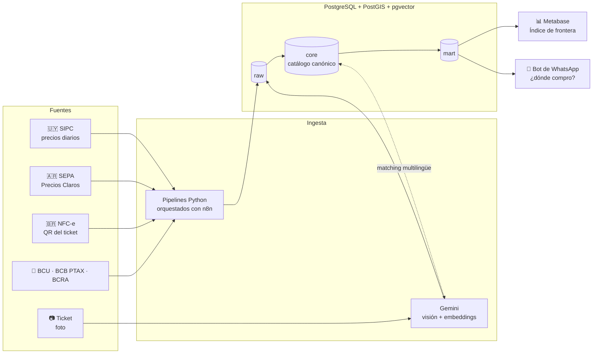

# 🛒 Precios de Frontera

**¿Conviene cruzar a comprar?** Comparador de precios de supermercados entre Uruguay y
sus ciudades de frontera con Brasil y Argentina, construido sobre datos abiertos
oficiales, con extracción de tickets por IA y matching de productos entre idiomas.

> 🚧 Proyecto en construcción. Ver [hoja de ruta](#hoja-de-ruta).

## El problema

En Rivera, Chuy, Artigas, Río Branco o Salto, mucha gente cruza la frontera para
comprar, pero decide "a ojo". Una comparación honesta tiene que considerar:

- precios en **tres monedas** (UYU, BRL, ARS) y el tipo de cambio real de frontera;
- productos **equivalentes en distintos idiomas y presentaciones**
  (*"Leche entera 1 L"* ↔ *"Leite integral 1L"*);
- **distancia**, costo de traslado y **límites de franquicia aduanera**;
- **cobertura**: si faltan datos de un lado, avisar en lugar de comparar mal.

## Ciudades

| Uruguay | Ciudad vecina | Frontera |
|---|---|---|
| Rivera | Santana do Livramento 🇧🇷 | seca |
| Chuy | Chuí 🇧🇷 | seca |
| Aceguá | Aceguá 🇧🇷 | seca |
| Artigas | Quaraí 🇧🇷 | puente |
| Río Branco | Jaguarão 🇧🇷 | puente |
| Bella Unión | Barra do Quaraí 🇧🇷 | puente |
| Salto | Concordia 🇦🇷 | represa |
| Paysandú | Colón 🇦🇷 | puente |
| Fray Bentos | Gualeguaychú 🇦🇷 | puente |

## Arquitectura



### Modelo de datos

Cada fuente conserva sus propios productos (`core.producto_fuente`). Un proceso de
matching los asocia a un **producto canónico** común a los tres países
(`core.producto_canonico`), primero por EAN, luego por reglas y similitud de texto
(`pg_trgm`) y finalmente por **embeddings multilingües** (`pgvector`).
La vista `mart.precio_comparable` lleva todos los precios a **USD por unidad base**
(kg, litro o unidad).

Esquema completo: [`sql/init/01_esquema.sql`](sql/init/01_esquema.sql).

## Fuentes de datos

| Fuente | País | Tipo | Acceso |
|---|---|---|---|
| [SIPC – Sistema de Información de Precios al Consumidor](https://www.precios.uy/) | 🇺🇾 | Oficial, diaria | [Datos abiertos](https://catalogodatos.gub.uy/dataset/?tags=Precios) |
| [Precios Claros – Base SEPA](https://datos.produccion.gob.ar/dataset/sepa-precios) | 🇦🇷 | Oficial, diaria | Datos abiertos (CC BY 4.0) |
| NFC-e (código QR del ticket) | 🇧🇷 | Ticket del usuario | Consulta pública SEFAZ |
| [PTAX – Banco Central do Brasil](https://dadosabertos.bcb.gov.br/dataset/dolar-americano-usd-todos-os-boletins-diarios) | 🇧🇷 | Tipo de cambio | API abierta |

No se hace *scraping* de sitios ni de aplicaciones que no ofrecen datos abiertos.

## Cómo levantarlo

Requisito: Docker Desktop. Python también corre en Docker, así que no hace falta
instalarlo ni armar un entorno virtual.

```bash
cp .env.example .env              # y cambiá POSTGRES_PASSWORD
docker compose up -d              # Postgres + Metabase
# docker compose --profile n8n up -d   # opcional: n8n propio del proyecto

# Pipelines: cada ejecución usa un contenedor descartable con el código montado
docker compose run --rm pipelines python -m pipelines.cambio.bcb_ptax --dias 30

# Notebooks: Jupyter Lab con el mismo entorno (el token aparece en los logs)
docker compose --profile jupyter up -d
docker compose logs jupyter
```

| Servicio | URL |
|---|---|
| Metabase | http://localhost:3000 |
| Postgres | `localhost:5433` (usuario y base según `.env`) |
| Jupyter Lab (perfil opcional) | http://localhost:8888 |
| n8n (perfil opcional) | http://localhost:5679 |

## Estructura

```
├── docker-compose.yml       # Postgres, Metabase, pipelines, Jupyter y n8n opcional
├── docker/postgres/         # imagen de Postgres con extensiones
├── docker/python/           # imagen de los pipelines y notebooks
├── sql/init/                # extensiones, esquema, datos base y vistas
├── pipelines/               # ingesta en Python (una carpeta por tipo de dato)
│   ├── cambio/              #   tipos de cambio (PTAX listo)
│   └── fuentes/             #   SIPC, SEPA, NFC-e
├── n8n/workflows/           # workflows exportados (sin credenciales)
├── notebooks/               # exploración de datos
├── eval/                    # conjuntos de prueba y métricas
└── data/                    # datos descargados (no se versionan)
```

## Hoja de ruta

- [x] Infraestructura: Postgres + PostGIS + pgvector + Metabase
- [x] Modelo de datos multi-país y vista comparable en USD
- [x] Pipeline de tipo de cambio: PTAX (Brasil)
- [ ] Tipos de cambio: BCU (Uruguay) y BCRA (Argentina)
- [ ] Ingesta SIPC 🇺🇾 (carga inicial + incremental diaria)
- [ ] Ingesta SEPA 🇦🇷
- [ ] Controles de calidad de datos y alertas
- [ ] Catálogo canónico y matching multilingüe (reglas → embeddings)
- [ ] Lectura de NFC-e 🇧🇷 desde el QR del ticket
- [ ] Extracción de tickets por foto con IA
- [ ] Recomendador: canasta más barata por local según ubicación y presupuesto
- [ ] Bot de WhatsApp (n8n)
- [ ] Dashboard "Índice de precios de frontera"
- [ ] Evaluación: precisión del matching y de la extracción de tickets

## Aviso

Los resultados son orientativos. Los límites de franquicia aduanera cambian: el
proyecto los maneja como parámetros con fuente y vigencia, y siempre deben
verificarse con la autoridad aduanera correspondiente.
