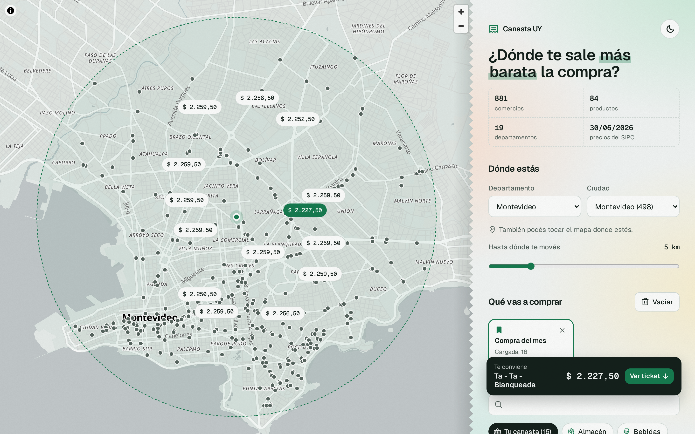
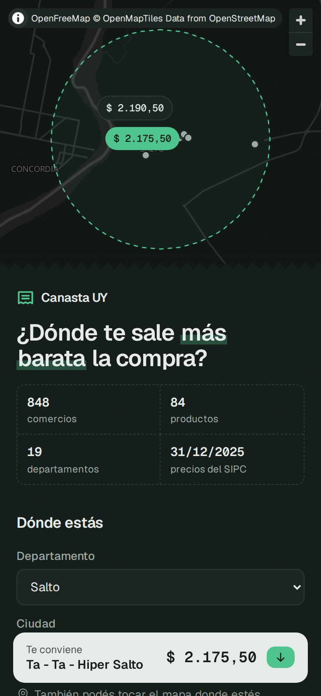
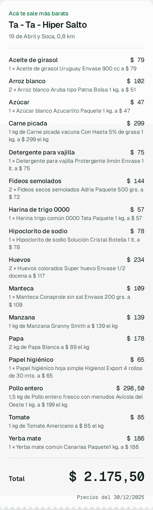
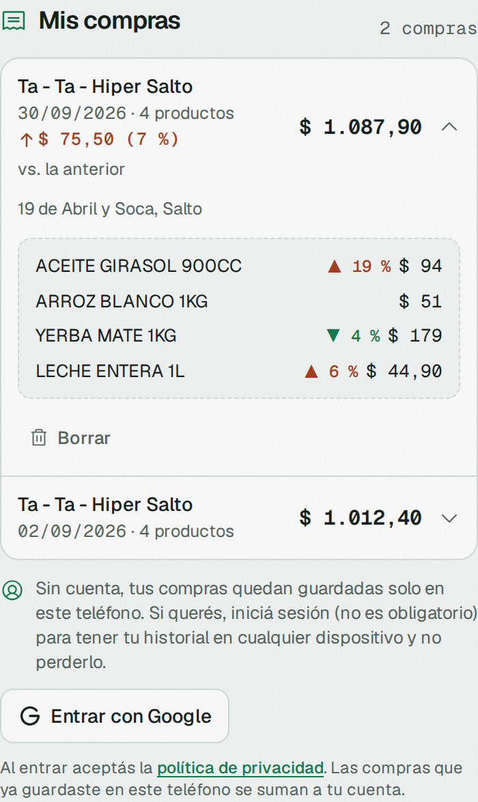
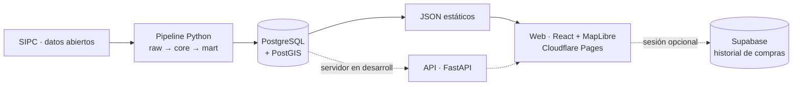

# 🛒 Canasta UY

**Dónde hacer tu compra más barata en Uruguay.** Elegís tu ciudad en el mapa, armás tu
canasta y la web te dice en qué comercio cercano te sale menos, con precios oficiales.

**👉 [canastauy.pages.dev](https://canastauy.pages.dev/)** · 881 comercios · 84 productos ·
19 departamentos · [política de privacidad](https://canastauy.pages.dev/privacidad)



<p align="center">
  
  
  
</p>

## El problema

En Uruguay el mismo changuito puede costar bastante distinto según el comercio, pero no hay
una forma simple de saber **dónde conviene**:

- **Quien vive acá** conoce dos o tres lugares, no todos los de su barrio, y comparar precio
  por precio es inviable: lo que importa es la **canasta entera**, no un producto suelto.
- **Quien está de paso** —turistas, estudiantes de intercambio, gente recién llegada— no
  tiene ninguna referencia de qué cadenas existen ni cuáles son más caras.

Los precios son públicos (el Estado los publica en el SIPC), pero vienen en archivos pensados
para analistas, no para alguien parado en la vereda con el teléfono.

## La solución

Canasta UY convierte esos datos abiertos en una respuesta directa. El usuario arma su canasta
con **productos genéricos** (*"aceite de girasol"*, no una marca) y la web:

- **compara la canasta completa** llevando cada producto a precio por kilo, litro o unidad,
  para que marcas y tamaños distintos sean comparables;
- **ubica los comercios cercanos** y ordena por el total de *tu* canasta;
- **es honesta con lo que falta:** si a un comercio le faltan productos, lo dice en vez de
  mostrarlo como el más barato;
- **muestra la fecha de los precios,** porque el SIPC se publica cada tanto.

Así, un local encuentra el comercio más conveniente de su zona y alguien de visita sabe, el
primer día, dónde hacer las compras sin pagar de más.

## Qué podés hacer

- **Armar la canasta** y ver en el mapa dónde sale más barata; guardarla en **Mis listas**
  para repetirla con un toque.
- **Guardar tus compras** desde el ticket: el QR de la DGI aporta comercio, fecha y total; la
  foto de la boleta, los productos (se lee en el teléfono, borrando antes los datos de pago y
  personales, y se revisa antes de guardar). **Mis compras** compara cada compra con la
  anterior y marca qué subió.
- **Cuenta opcional** con Google para tener el historial en cualquier dispositivo. Sin cuenta,
  todo queda en el teléfono.

## Arquitectura



El pipeline limpia el SIPC en tres capas: **`raw`** (cada archivo tal cual, con sus errores),
**`core`** (datos validados: coordenadas corregidas, duplicados eliminados, cantidad y unidad
separadas) y **`mart`** (lo que consume la web). Esquema en
[`sql/init/`](sql/init/01_esquema.sql), limpieza del SIPC en
[`sql/transform/`](sql/transform/sipc_core.sql).

**La web se publica sin servidor ni costo.** Un script exporta los precios vigentes a dos
archivos JSON (~280 KB comprimidos) y la canasta se cotiza en el navegador con
[`cotizar.ts`](web/src/lib/cotizar.ts), una copia de la función SQL `mart.cotizar_canasta`; un
test verifica que las dos den exactamente lo mismo. Un workflow de GitHub Actions baja el SIPC
cada mes, regenera los archivos y vuelve a publicar en Cloudflare Pages. La cuenta opcional y el
historial viven en Supabase, con aislamiento por usuario (Row Level Security); ver
[`docs/SEGURIDAD.md`](docs/SEGURIDAD.md).

## Fuentes de datos

| Fuente | Uso | Acceso |
|---|---|---|
| [SIPC – Defensa del Consumidor (MEF)](https://www.precios.uy/) | Precios, comercios y productos | [Datos abiertos](https://catalogodatos.gub.uy/dataset/defensa-del-consumidor-sistema-de-informacion-de-precios-al-consumidor-2026) |
| Ticket del usuario | Su propio historial de compras | QR del CFE (DGI) o foto, leídos en el teléfono |

No se hace *scraping*. El detalle de las fuentes, incluidas las descartadas, está en
[`docs/FUENTES.md`](docs/FUENTES.md).

## Cómo levantarlo

Único requisito: Docker Desktop (Python y Node corren en contenedores).

```bash
cp .env.example .env              # y cambiá POSTGRES_PASSWORD
docker compose up -d              # Postgres, Metabase, API y web

docker compose run --rm pipelines python -m pipelines.fuentes.sipc   # ingesta del SIPC (~3 GB)
docker compose run --rm pipelines pytest -v                          # tests de la API
docker compose run --rm eval-boletas                                 # banco del lector de boletas
```

| Servicio | URL |
|---|---|
| **Web** | http://localhost:5173 |
| API (docs interactivas) | http://localhost:8000/docs |
| Metabase | http://localhost:3000 |
| Postgres | `localhost:5433` (credenciales según `.env`) |

## Estructura

```
sql/init/          esquema y vistas (raw, core, mart)
sql/transform/     limpieza del SIPC (raw → core)
sql/supabase/      tabla de compras con Row Level Security
pipelines/         ingesta del SIPC y exportación a JSON
api/               API FastAPI (desarrollo)
web/               web React + Vite (mapa, canasta, tickets)
eval/boletas/      banco de pruebas del lector de boletas
.github/workflows/ publicación y actualización mensual
docs/              contexto, fuentes, seguridad y privacidad
```

## Hoja de ruta

- [x] Ingesta y limpieza del SIPC (40 M de precios) en tres capas
- [x] Catálogo de productos genéricos y precio por unidad base
- [x] Cotización de la canasta: total por comercio, cobertura y faltantes
- [x] Web con mapa interactivo, resultados en forma de ticket y listas guardadas
- [x] Mis compras desde el ticket (QR + boleta), comparadas con la compra anterior
- [x] Cuentas opcionales (Supabase) y página de privacidad
- [x] Despliegue público gratis en Cloudflare Pages, actualizado solo cada mes
- [x] Auditoría de seguridad ([`docs/SEGURIDAD.md`](docs/SEGURIDAD.md)) y lector de boletas medido ([`eval/boletas`](eval/boletas/README.md))
- [ ] Inscripción en la URCDP (enviada, pendiente de revisión — [`docs/URCDP.md`](docs/URCDP.md))
- [ ] Precios de frutas y verduras (el SIPC no los trae)
- [ ] Que el ticket compare la misma compra contra otros comercios

## Aviso

Los precios provienen del SIPC y tienen la fecha de su última publicación, que la web muestra
siempre. Son orientativos: verificá el precio en el comercio.
