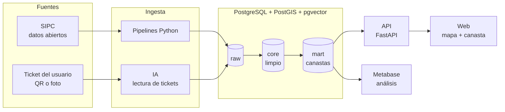

# 🛒 Canasta UY

**Compras al menor costo en Uruguay.** Una web donde ponés tu presupuesto, elegís tu
ciudad en un mapa y armás tu canasta con productos genéricos ("aceite de girasol",
"arroz"). Te muestra en qué comercios te conviene comprarla. Después podés subir tu
ticket y ver cómo te fue comparado con tu compra anterior.

Construida sobre los **datos abiertos oficiales del SIPC** (Sistema de Información de
Precios al Consumidor): 27 millones de precios de 2025 en más de 800 comercios de todo el país.

> 🚧 Proyecto en construcción. Ver [hoja de ruta](#hoja-de-ruta).

## Qué resuelve

Para saber dónde conviene comprar, hay que comparar la **canasta completa**, no un
producto suelto. Para eso hace falta:

- **comparar productos genéricos** entre marcas y tamaños: se lleva todo a precio por
  kilo, litro o unidad (*"Envase 900 cc"* → 0,9 l);
- **ubicar los comercios** cerca del usuario (PostGIS);
- **avisar la cobertura:** si un comercio no tiene todos los productos de la canasta,
  decirlo en lugar de comparar mal;
- **mostrar la antigüedad de los precios**: el SIPC se publica cada trimestre.

## Arquitectura



### Capas de datos

- **`raw`:** cada archivo tal cual vino de la fuente, con sus errores. Permite volver
  siempre al original.
- **`core`:** datos limpios y validados. Por ejemplo, se corrigen las coordenadas de los
  comercios (el SIPC trae latitud y longitud cruzadas), se eliminan los precios duplicados
  del mismo día y se separan cantidad y unidad (*"Paquete1 kg."* → 1 kg).
- **`mart`:** tablas y vistas listas para la web y los dashboards.

Esquema: [`sql/init/01_esquema.sql`](sql/init/01_esquema.sql) · Transformación del
SIPC: [`sql/transform/sipc_core.sql`](sql/transform/sipc_core.sql).

## Fuentes de datos

| Fuente | Uso | Acceso |
|---|---|---|
| [SIPC – Defensa del Consumidor (MEF)](https://www.precios.uy/) | Precios, comercios y productos | [Datos abiertos](https://catalogodatos.gub.uy/dataset/defensa-del-consumidor-sistema-de-informacion-de-precios-al-consumidor-2025) |
| Tickets de los usuarios | Precios actuales y compras de cada usuario | QR del CFE (DGI) o foto |

Detalle de todas las fuentes, incluidas las evaluadas y descartadas:
[`docs/FUENTES.md`](docs/FUENTES.md). No se hace *scraping* de sitios ni de aplicaciones.

## Cómo levantarlo

Requisito: Docker Desktop. Python también corre en Docker, así que no hace falta
instalarlo ni armar un entorno virtual.

```bash
cp .env.example .env              # y cambiá POSTGRES_PASSWORD
docker compose up -d              # Postgres + Metabase

# Pipeline del SIPC: descarga (~2 GB), carga en raw y limpieza a core
docker compose run --rm pipelines python -m pipelines.fuentes.sipc

# Notebooks: Jupyter Lab con el mismo entorno (el token aparece en los logs)
docker compose --profile jupyter up -d
docker compose logs jupyter
```

| Servicio | URL |
|---|---|
| Metabase | http://localhost:3000 |
| Postgres | `localhost:5433` (usuario y base según `.env`) |
| Jupyter Lab (perfil opcional) | http://localhost:8888 |

## Estructura

```
├── docker-compose.yml       # Postgres, Metabase, pipelines, Jupyter y n8n opcional
├── docker/postgres/         # imagen de Postgres con extensiones
├── docker/python/           # imagen de los pipelines y notebooks
├── sql/init/                # extensiones, esquema, datos base, vistas y tablas raw
├── sql/transform/           # transformaciones raw → core (una por fuente)
├── pipelines/fuentes/       # ingesta por fuente (SIPC)
├── docs/                    # contexto del proyecto y fuentes de datos
├── notebooks/               # exploración de datos
├── eval/                    # conjuntos de prueba y métricas
└── data/                    # datos descargados (no se versionan)
```

## Hoja de ruta

- [x] Infraestructura: Postgres + PostGIS + pgvector + Metabase, todo en Docker
- [x] Ingesta del SIPC a la capa raw (27 M precios de 2025)
- [x] Limpieza del SIPC a core: coordenadas, duplicados, cantidades, reporte de calidad
- [ ] Categorías genéricas sin marca y precio por unidad base
- [ ] Consulta de canasta: costo por comercio, cobertura y presupuesto
- [ ] API (FastAPI)
- [ ] Web con mapa interactivo (Leaflet + OpenStreetMap)
- [ ] Cuentas de usuario y carga de tickets (QR del CFE o foto con IA)
- [ ] Comparación con la compra anterior
- [ ] Controles de calidad guardados por carga
- [ ] Despliegue público

## Aviso

Los resultados son orientativos: los precios provienen del SIPC y tienen la fecha de su
última publicación, que la web muestra siempre. Verificá el precio en el comercio.
